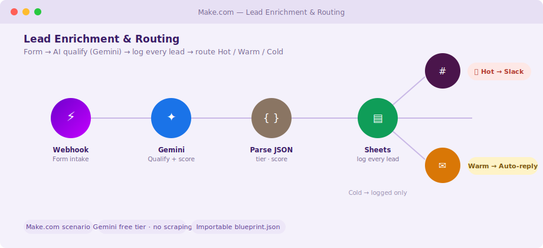

# Lead Enrichment & Routing (Make.com)

A [Make.com](https://www.make.com) scenario that turns a raw website/contact-form submission into a
**qualified, routed, logged lead** in seconds — no manual triage. A lead comes in, **Google Gemini**
scores it and drafts a reply, **every** lead is logged to a Google Sheet, and a router sends **Hot**
leads to Slack for the sales team and **Warm** leads an automatic AI-drafted acknowledgement. Cold
leads are simply logged.

Built as a portfolio piece to show the same AI-automation approach on **Make** (visual scenarios)
rather than n8n — the design is platform-agnostic; only the tool changes.

## Preview



<sub>Illustrative mockup of the Make scenario canvas. To use a real screenshot instead: import
`blueprint.json`, open the scenario, capture the canvas, save it as `docs/screenshot.png`, and point
the image above at that file.</sub>

## What it does

```
Webhook (form intake)
      │  { name, email, company, message }
   Gemini  ── one call: returns { tier: Hot|Warm|Cold, score 0–100, reason, reply }
      │
  Parse JSON
      │
  Google Sheets ── append EVERY lead (timestamp, name, company, email, tier, score, reason)
      │
   Router ─┬─ [tier = Hot]  → Slack #sales-hot-leads  (🔥 ping the team now)
           ├─ [tier = Warm] → Email  (send the AI-drafted acknowledgement automatically)
           └─ [tier = Cold] → (no route matches → logged only)
```

One Gemini call does the reasoning **and** writes the reply, so the whole scenario is a single free-tier
request per lead. Nothing is sent to a customer except the Warm auto-reply, and that copy is model-
generated — swap in a fixed template if you'd rather not auto-send.

## Setup

1. **Import the blueprint.** In Make: *Create a new scenario → ••• (bottom bar) → Import Blueprint →*
   [`blueprint.json`](blueprint.json).
2. **Connect the apps** the scenario uses:
   - **Google Gemini** — the HTTP module sends your key in an `x-goog-api-key` header. Get a free key at
     [Google AI Studio](https://aistudio.google.com/apikey) and paste it into that header (or a Make
     *keychain* connection). No credit card, no scraping.
   - **Google Sheets** — connect your Google account and set the `spreadsheetId` (replace
     `REPLACE_WITH_SHEET_ID`) to a sheet with a `Leads` tab and columns
     `date, name, company, email, tier, score, reason`.
   - **Slack** — connect and confirm the channel (`#sales-hot-leads`).
   - **Email** — connect an SMTP/Gmail account for the Warm auto-reply.
3. **Copy the webhook URL** from the first module and point your form (Typeform, a site form, Zapier,
   etc.) at it — POST JSON `{ name, email, company, message }`.
4. **Run once** to test, then **schedule/activate** (Make runs it on each webhook hit).

> **Import note:** Make bumps module versions over time, so on import Make may ask you to re-select an
> app version or reconnect a module — that's expected. The blueprint is a faithful reference of the
> logic; treat any version prompt as a one-click confirm, not an error.

## Reuse for a client

Change three things and it's theirs: the **Sheet ID**, the **Slack channel**, and (optionally) the
qualifier prompt in the Gemini HTTP module (industry, what counts as "Hot"). The routing logic
doesn't change.

## Files

- `blueprint.json` — the importable Make scenario.
- `workflows/lead_enrichment_routing.md` — the SOP (objective, inputs, tools, edge cases).
- `docs/preview.svg` — the scenario mockup used above.

## Notes on cost & safety

- **Free-tier friendly:** Gemini free tier is far more than enough (one call per lead). Make's free
  plan covers low lead volume; higher volume needs a paid Make plan (operations-based).
- **No secrets in this repo:** the API key lives in your Make connection/header, never in the JSON —
  `blueprint.json` ships with placeholders only.
- **Human-in-the-loop option:** point the Warm branch at a *draft* (Gmail draft / Slack approval)
  instead of a direct send if you want a person to approve every outbound message.
