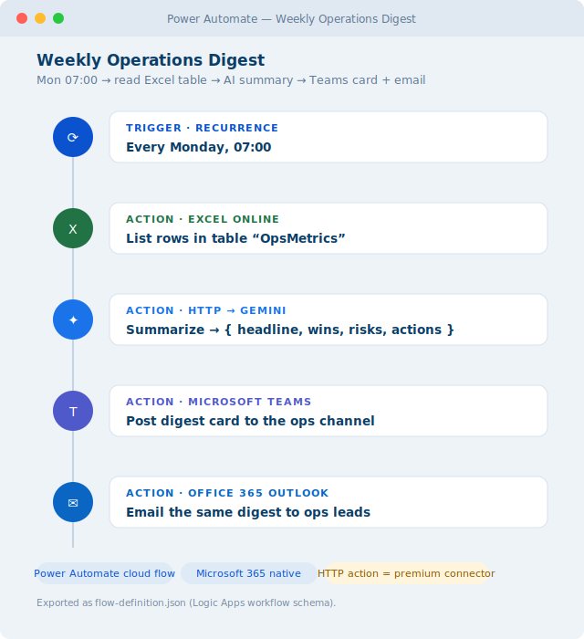

# Weekly Operations Digest (Power Automate)

A [Microsoft Power Automate](https://make.powerautomate.com) cloud flow that runs **every Monday at
07:00**, reads a **weekly metrics table in Excel Online**, uses **Google Gemini** to write a short
executive **summary (headline · wins · risks · actions)**, and posts it as a **Microsoft Teams** card
**and** emails it to the ops leads via **Office 365 Outlook**. The Monday status update writes itself.

Built as a portfolio piece to show the same AI-automation approach on **Power Automate** — the
automation layer inside Microsoft 365, where most companies already live (Excel, Teams, Outlook).

## Preview



<sub>Illustrative mockup of the flow designer (trigger + actions). To use a real screenshot instead:
build the flow from `flow-definition.json`, open the designer, capture it, save it as
`docs/screenshot.png`, and point the image above at that file.</sub>

## What it does

```
Recurrence — Mon 07:00
      │
  Excel Online → List rows in table "OpsMetrics"      (Metric, ThisWeek, LastWeek)
      │
  Select → one line per metric  ("Signups: 412 (prev 380)")
      │
  HTTP → Gemini  ── returns { headline, wins[], risks[], actions[] }
      │
  Parse JSON
      ├─ Teams  → post the digest card to the ops channel
      └─ Outlook → email the same digest to ops-leads@yourco.com
```

## Import / build

Power Automate exports flows as a **`.zip` package**, but the meaningful part is the flow's
**definition JSON** (the Azure Logic Apps workflow schema). This repo ships that as
[`flow-definition.json`](flow-definition.json). Two ways to use it:

- **Recreate in the designer (recommended):** build the 6 steps shown above; `flow-definition.json` is
  the exact reference for every action's inputs and expressions (copy the trigger schedule, the Gemini
  body, and the `body('Parse_summary')?['…']` output bindings).
- **Import as a package:** wrap the definition in a solution/package `.zip` and use *My flows → Import*.
  Connection references (`shared_excelonlinebusiness`, `shared_teams`, `shared_office365`) are re-mapped
  to your own connections during import.

## Setup

1. **Excel table** — a workbook on OneDrive/SharePoint with a table named `OpsMetrics`
   (columns `Metric, ThisWeek, LastWeek`). Set the workbook id (replace `REPLACE_WITH_WORKBOOK_ID`).
2. **Connections** — Excel Online (Business), Microsoft Teams, Office 365 Outlook (all part of a normal
   Microsoft 365 account).
3. **Gemini key** — free key from [Google AI Studio](https://aistudio.google.com/apikey), placed in the
   HTTP action's `x-goog-api-key` header. No card required.
4. **Targets** — set the Teams channel id (replace `REPLACE_WITH_TEAMS_CHANNEL_ID`) and the email
   recipient. Adjust the `timeZone` on the trigger.
5. **Test** with *Run* → then leave the flow **On**.

> **Premium-connector note (be aware):** the generic **HTTP** action is a **premium** Power Automate
> connector, so the Gemini call needs a Power Automate **Premium** plan. Two alternatives if you're on
> the seeded Microsoft 365 plan: (a) use **AI Builder**'s *Create text with GPT* action instead of HTTP
> (also premium, but native), or (b) call Gemini from an **Azure Function** and trigger that. The Excel /
> Teams / Outlook steps themselves are all standard (non-premium).

## Reuse for a client

Point it at the client's workbook/table, Teams channel, and recipient list, and tune the summary prompt
(what "wins/risks" mean for their business). The schedule and structure stay the same — swap Monday
07:00 for their reporting cadence.

## Files

- `flow-definition.json` — the flow's workflow definition (Logic Apps schema) — the build/import reference.
- `workflows/weekly_ops_digest.md` — the SOP (objective, inputs, edge cases).
- `docs/preview.svg` — the flow-designer mockup used above.

## Notes on cost & safety

- **AI side is free:** one Gemini free-tier call per run (once a week). The cost consideration is the
  Power Automate **Premium** requirement for the HTTP action (see note above), not the AI.
- **No secrets in this repo:** the Gemini key lives in the flow's HTTP header / a secure connection,
  never in `flow-definition.json` (which ships with placeholders).
- **Read + report only:** the flow reads a sheet and posts a summary — it changes no business data and
  emails only an internal distribution list.
