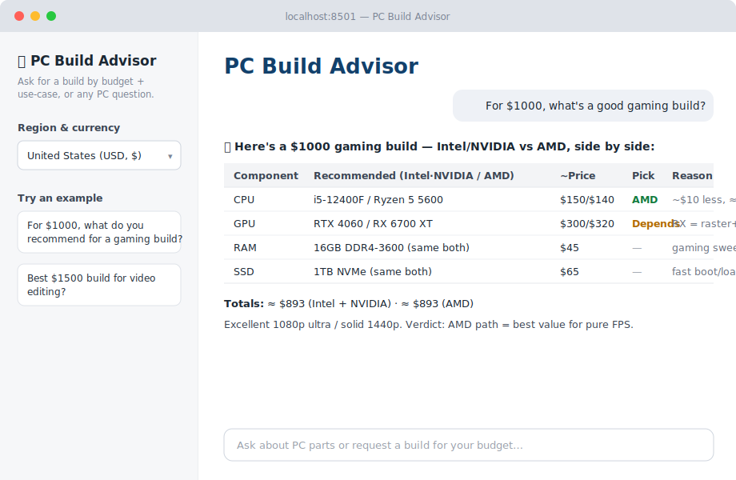
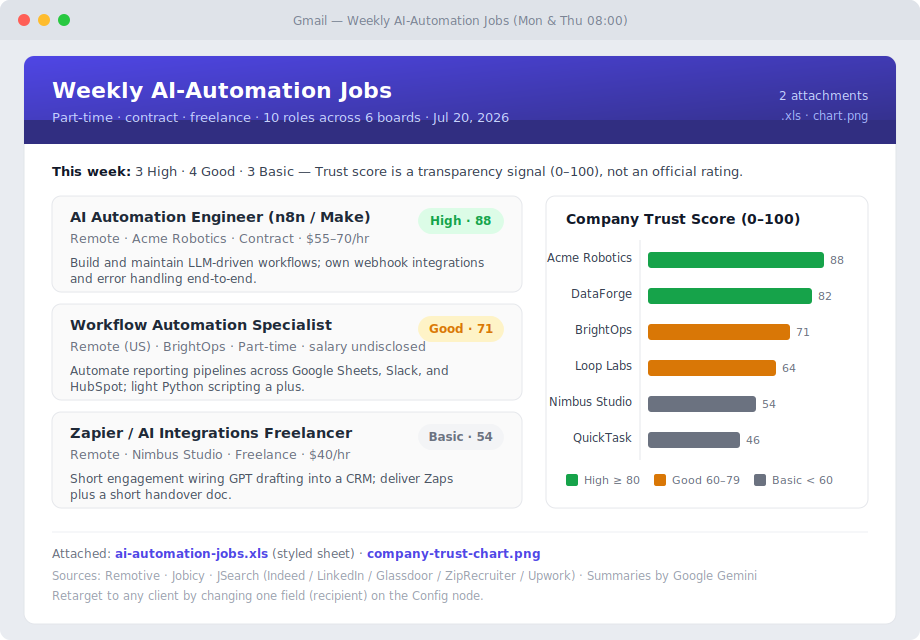

# AI Automation — Portfolio

**John Ryan Haban — AI Automation Specialist**

I build **AI-powered automations** that do real work: scoring and routing leads, triaging support,
turning a single URL into a competitor analysis, and delivering designed reports straight to an inbox,
a spreadsheet, Slack, or Teams. Every project here runs on **free-tier APIs** (no scraping, no paid
models required to try it), keeps a human in the loop where it matters, and ships with a clear README
so you can see exactly what it does.

**What I do:** connect the tools a business already uses (Gmail, Sheets, Slack, Teams, Excel, a website
form) and put an LLM in the middle to handle the judgment — qualify, summarize, draft, categorize — so
the repetitive work runs itself.

---

## Projects

### 🖥️ PC Build Advisor — *AI chatbot*
Tell it a budget and use-case; it returns a full PC build as a side-by-side **Intel/NVIDIA vs AMD**
table with prices, picks, store links, and an upgrade path. Streamlit + Google Gemini, prices in your
local currency.

**How it works**
1. You ask in plain English — a budget and what the PC is for (gaming, editing, office).
2. The model applies real build rules — budget split across parts and compatibility — to choose components.
3. It returns one side-by-side Intel/NVIDIA vs AMD table: local-currency prices, a pick + reason per part, store suggestions, one-click price-check links, and an upgrade path.
4. Ask follow-ups like a chat — answers stream in live.

**Stack:** Python · Streamlit · Google Gemini &nbsp;•&nbsp; **Repo:** https://github.com/BaschFonRonsenburg/pc-build-advisor

---

### 📬 Weekly AI-Automation Job Report — *n8n, scheduled*
Runs twice a week, pulls remote AI/automation part-time roles from three job APIs, scores each employer
for legitimacy (a 0–100 **Trust score**), writes a one-line AI summary per role, and emails a **designed
HTML report** with a Trust-score chart and a styled spreadsheet attached.

**How it works**
1. On a set schedule it pulls fresh listings from three job boards at once.
2. It keeps only part-time / contract AI-automation roles, removes duplicates, and drops the noise.
3. Each employer gets a 0–100 Trust score for legitimacy — every point backed by a stated reason.
4. The model writes a one-line summary per role, then it emails a designed report with a Trust-score chart plus a styled spreadsheet attached.

**Stack:** n8n · Google Gemini · Gmail · multi-source job APIs &nbsp;•&nbsp; **Repo:** https://github.com/BaschFonRonsenburg/n8n-ai-automation-job-report

---

### 📊 Competitive Edge Campaign Builder — *n8n, on-demand*
Submit one company URL. It reads the site, discovers real competitors, analyzes the **gaps**, writes a
prioritized action plan **and** a ready-to-post ad campaign, then emails a **themed PDF** that
re-skins to match the company's industry. Everything is a draft for human review.

**How it works**
1. You submit one company website in a simple web form.
2. It reads that site to understand the business, then finds and reads real competitors.
3. The model maps where the company is losing ground and writes prioritized moves plus a positioning angle.
4. It drafts a full campaign — email + social posts — and emails a polished PDF that re-skins to the company's industry. Everything is a draft for your review.

**Stack:** n8n · Google Gemini · DuckDuckGo · PDFShift · Gmail &nbsp;•&nbsp; **Repo:** https://github.com/BaschFonRonsenburg/marketing-automation

---

## Also built on these platforms

The same automation approach, shown on the other major no-code platforms. Each is a self-contained demo
with its own README, an importable/reference definition, and a mockup.

| Platform | Demo | What it does |
|---|---|---|
| **Make.com** | [Lead Enrichment & Routing](MAKE%20-%20LEAD%20ENRICHMENT/) | Form → AI qualify + score → log every lead → route Hot to Slack, Warm to auto-reply |
| **Zapier** | [Support Email Triage](ZAPIER%20-%20SUPPORT%20TRIAGE/) | New email → AI categorize + draft reply → **Gmail draft a human approves** → log + Slack |
| **Zapier** | [Content Repurposer](ZAPIER%20-%20CONTENT%20REPURPOSER/) | New blog post → AI writes LinkedIn + X thread + newsletter → **3 Google Docs drafts to review** → log + Slack |
| **Power Automate** | [Weekly Operations Digest](POWER%20AUTOMATE%20-%20OPS%20DIGEST/) | Mon 07:00 → read Excel table → AI summary → post to Teams + email the ops leads |

---

## Capabilities

- **Automation platforms:** n8n (deep — self-hosted & cloud, custom code nodes) · Make.com · Zapier ·
  Microsoft Power Automate
- **AI / LLM:** Google Gemini, prompt design, structured JSON output, batching for free-tier limits,
  human-in-the-loop review
- **Apps & delivery:** Gmail / Outlook · Google Sheets / Excel · Slack / Teams · webhooks & forms ·
  designed HTML email · PDF reports · styled spreadsheets
- **Also:** Python · Streamlit chatbots · web scraping/enrichment · scheduled & event-driven workflows

## How I work

**Start lean, prove it works, then scale it to fit.** The demos here run on free tiers so you can see the
approach working — but that's the floor, not the ceiling.

- **Built around your workflow** — I map the process you actually run and wire in the tools you already
  use (email, sheets, Slack, Teams, your CRM). The automation fits your business; it isn't a template.
- **Proven first, then scaled** — free tiers to prove it at zero cost, then production when you're ready:
  higher volume, premium connectors, more capable models, and monitoring — sized to what you need.
- **Yours to own** — clear docs and your own keys, so nothing is locked to me. A non-technical team can
  run it, and it grows with you.

## Contact

**John Ryan Haban** — AI Automation Specialist

- **Email:** haban.johnryandc@gmail.com
- **OnlineJobs.ph:** https://www.onlinejobs.ph/jobseekers/info/2372797
- **LinkedIn:** https://www.linkedin.com/in/john-ryan-haban07

Project previews are illustrative mockups; each project's README explains how to render real output.
The Make/Zapier/Power Automate demos live in this folder; the three featured projects are public GitHub
repos linked above.
