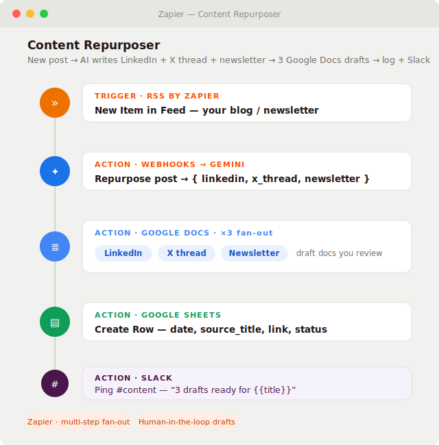

# Content Repurposer (Zapier)

A [Zapier](https://zapier.com) Zap that watches a blog's **RSS feed**, and the moment a new post goes
live uses **Google Gemini** to rewrite it into three channels — a **LinkedIn post**, an **X/Twitter
thread**, and a **newsletter blurb** — then drops each one into its own **Google Doc for you to review
and post**, logs the run to a Google Sheet, and pings Slack that the drafts are ready. One post fans
out everywhere, and a human still approves every word before it's published.

Built as a portfolio piece to show the same AI-automation approach on **Zapier** — the most widely used
no-code platform — leaning on the thing Zapier does best, **multi-app fan-out**, with a deliberate
**human-in-the-loop** design (drafts, never auto-posts).

## Preview



<sub>Illustrative mockup of the Zap editor (trigger + steps). To use a real screenshot instead: build
the Zap from the steps below, open the editor, capture it, save it as `docs/screenshot.png`, and point
the image above at that file.</sub>

> **Why no import file?** Unlike n8n and Make, **Zapier has no public blueprint import** — Zaps are
> shared as templates from inside a Zapier account, not as a file you commit. So this project documents
> the Zap step-by-step (below) instead of shipping a `.json`. Everything needed to rebuild it in ~10
> minutes is here.

## The Zap, step by step

| # | Step | App · Event | Key config |
|---|------|-------------|-----------|
| 1 | **Trigger** | RSS by Zapier · *New Item in Feed* | Feed URL of your blog/newsletter; gives `title`, `link`, `content` |
| 2 | **Action** | Webhooks by Zapier · *POST* | Call Gemini (see below); returns `{ linkedin, x_thread, newsletter }` |
| 3 | *(optional)* | Formatter / Code by Zapier | Parse the model's JSON string into fields |
| 4 | **Action** | Google Docs · *Create Document from Text* | LinkedIn post → doc `LinkedIn — {{title}}` |
| 5 | **Action** | Google Docs · *Create Document from Text* | X/Twitter thread → doc `X thread — {{title}}` |
| 6 | **Action** | Google Docs · *Create Document from Text* | Newsletter blurb → doc `Newsletter — {{title}}` |
| 7 | **Action** | Google Sheets · *Create Spreadsheet Row* | `date, source_title, link, status=drafted` |
| 8 | **Action** | Slack · *Send Channel Message* | Ping `#content`: "3 drafts ready for {{title}}" + the doc links |

> **Repurposing a YouTube channel instead?** Swap step 1 for **YouTube · New Video in Your Channel**
> and feed the video `title` + `description` into step 2 — everything after it stays the same.

### Step 2 — the AI call (free, no OpenAI needed)
Use **Webhooks by Zapier → POST** so the whole thing runs on the Gemini free tier:

- **URL:** `https://generativelanguage.googleapis.com/v1beta/models/gemini-flash-latest:generateContent`
- **Headers:** `x-goog-api-key: <your free key>`, `Content-Type: application/json`
- **Body (JSON):**
  ```json
  {"contents":[{"parts":[{"text":"You are a content repurposing assistant. Return ONLY compact JSON: {\"linkedin\":\"a first-person LinkedIn post, 3 short paragraphs, no hashtags spam\",\"x_thread\":\"a 4-6 tweet thread, each tweet on its own line prefixed 1/ 2/ ...\",\"newsletter\":\"a 2-sentence newsletter blurb with a call to read more\"}. Repurpose this blog post titled {{title}}: {{content}}"}]}]}
  ```
- Map `linkedin`, `x_thread`, and `newsletter` out of the response into steps 4–6.

> Prefer Zapier's native **OpenAI / ChatGPT** action instead? Swap step 2 for it — same idea, but it
> bills against an OpenAI key rather than Gemini's free tier.

## Setup

1. Create a new Zap and add the steps in the table above.
2. **Connect apps:** Google Docs (three draft docs), Google Sheets (log), Slack (ready ping). For
   step 2, paste your **free Gemini key** ([Google AI Studio](https://aistudio.google.com/apikey))
   into the Webhooks header — no card required.
3. Point the RSS trigger at your blog's feed URL, and prepare a Google Sheet with columns
   `date, source_title, link, status`.
4. **Test** each step with a recent post, then **turn the Zap on**.

## Reuse for a client

Change the RSS feed URL, the Google Docs folder, the Sheet, and the Slack channel. Edit the channels
in the step-2 prompt — drop the newsletter, add an Instagram caption, change the tone — without
touching the wiring. The review-before-you-post design stays; that's the safety guarantee clients like.

## Files

- `README.md` — this file (the Zap is documented here since Zapier has no import file).
- `workflows/content_repurposer.md` — the SOP (objective, inputs, edge cases).
- `docs/preview.svg` — the Zap-editor mockup used above.

## Notes on cost & safety

- **Free-tier friendly on the AI side:** one Gemini free-tier call per new post. RSS by Zapier and the
  Google Docs / Sheets / Slack connectors are all free. Multi-step Zaps need a paid Zapier plan — a
  stripped **2-step version** (RSS trigger → one Google Doc holding all three channels) runs on the
  free plan.
- **No secrets in this repo:** the Gemini key lives in the Zap's Webhooks header, never in a file here.
- **Human-in-the-loop by design:** every channel is an editable Google Doc draft. The Zap never posts
  to LinkedIn, X, or a newsletter on its own — a person reviews and publishes each one.
