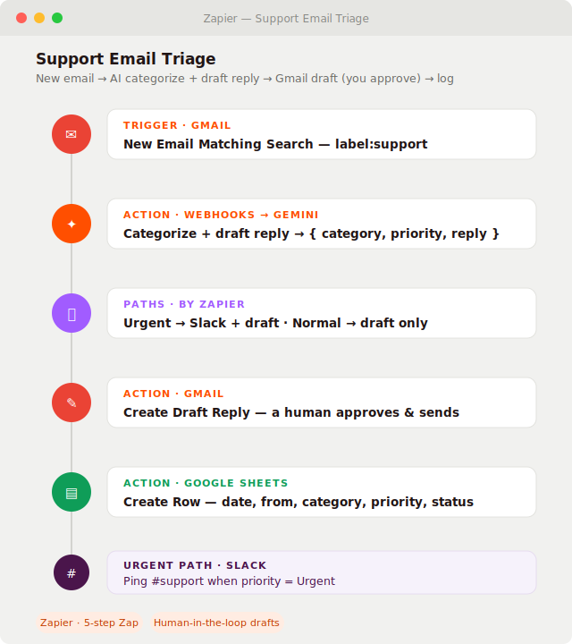

# Support Email Triage (Zapier)

A [Zapier](https://zapier.com) Zap that reads incoming **support emails**, uses **Google Gemini** to
**categorize** each one and **draft a reply**, then creates a **Gmail draft a human approves and sends** —
logging every ticket to a Google Sheet and pinging Slack for urgent ones. It clears the triage backlog
without ever sending an unreviewed message to a customer.

Built as a portfolio piece to show the same AI-automation approach on **Zapier** — the most widely used
no-code platform — with a deliberate **human-in-the-loop** design (drafts, not auto-sends).

## Preview



<sub>Illustrative mockup of the Zap editor (trigger + steps). To use a real screenshot instead: build
the Zap from the steps below, open the editor, capture it, save it as `docs/screenshot.png`, and point
the image above at that file.</sub>

> **Why no import file?** Unlike n8n and Make, **Zapier has no public blueprint import** — Zaps are
> shared as templates from inside a Zapier account, not as a file you commit. So this project documents
> the Zap step-by-step (below) instead of shipping a `.json`. Everything needed to rebuild it in ~10
> minutes is here.

## The Zap, step by step

| # | Step | App · Event | Key config |
|---|------|-------------|-----------|
| 1 | **Trigger** | Gmail · *New Email Matching Search* | Search `label:support` (or `to:support@…`) |
| 2 | **Action** | Webhooks by Zapier · *POST* | Call Gemini (see below); returns `{ category, priority, reply }` |
| 3 | *(optional)* | Formatter / Code by Zapier | Parse the model's JSON string into fields |
| 4 | **Paths** | Paths by Zapier | `priority = Urgent` → also do step 6; else continue |
| 5 | **Action** | Gmail · *Create Draft Reply* | To: `{{from}}`, body: `{{reply}}` — **a person approves & sends** |
| 6 | **Action** | Google Sheets · *Create Spreadsheet Row* | `date, from, subject, category, priority, status=drafted` |
| 7 | **Urgent path** | Slack · *Send Channel Message* | Ping `#support`: subject + priority + link |

### Step 2 — the AI call (free, no OpenAI needed)
Use **Webhooks by Zapier → POST** so the whole thing runs on the Gemini free tier:

- **URL:** `https://generativelanguage.googleapis.com/v1beta/models/gemini-flash-latest:generateContent`
- **Headers:** `x-goog-api-key: <your free key>`, `Content-Type: application/json`
- **Body (JSON):**
  ```json
  {"contents":[{"parts":[{"text":"You are a support triage assistant. Return ONLY compact JSON: {\"category\":\"Billing|Technical|Account|Other\",\"priority\":\"Urgent|Normal|Low\",\"reply\":\"a friendly 3-sentence draft reply\"}. Email from {{from}}, subject {{subject}}: {{body_plain}}"}]}]}
  ```
- Map `category`, `priority`, and `reply` out of the response for the later steps.

> Prefer Zapier's native **OpenAI / ChatGPT** action instead? Swap step 2 for it — same idea, but it
> bills against an OpenAI key rather than Gemini's free tier.

## Setup

1. Create a new Zap and add the steps in the table above.
2. **Connect apps:** Gmail (trigger + draft), Google Sheets (log), Slack (urgent path). For step 2,
   paste your **free Gemini key** ([Google AI Studio](https://aistudio.google.com/apikey)) into the
   Webhooks header — no card required.
3. Prepare a Google Sheet with columns `date, from, subject, category, priority, status`.
4. **Test** each step with a sample email, then **turn the Zap on**.

## Reuse for a client

Change the trigger search (`label:support`), the Sheet, the Slack channel, and the categories in the
step-2 prompt. The human-in-the-loop draft step stays — that's the safety guarantee clients like.

## Files

- `README.md` — this file (the Zap is documented here since Zapier has no import file).
- `workflows/support_email_triage.md` — the SOP (objective, inputs, edge cases).
- `docs/preview.svg` — the Zap-editor mockup used above.

## Notes on cost & safety

- **Free-tier friendly on the AI side:** one Gemini free-tier call per email. Zapier's own free plan
  covers low volume and 2-step Zaps; Paths/multi-step Zaps need a paid Zapier plan.
- **No secrets in this repo:** the Gemini key lives in the Zap's Webhooks header, never in a file here.
- **Human-in-the-loop by design:** the customer only ever receives a reply a person reviewed and sent
  from the Gmail draft — the automation never emails a customer on its own.
